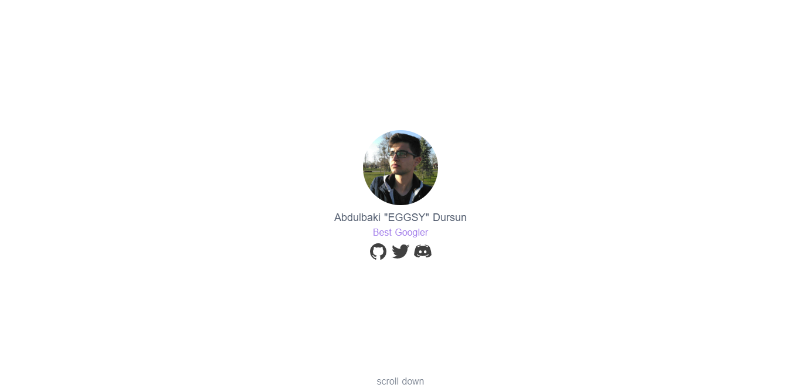

# ✨ Fullpage Portfolio

Hey there! Thank you for checking out this project. This is a very basic website boilerplate/template (or however you want to call it) that you can use as an example creating yourself a portfolio website. Nice UI, easily configurable options and more!

### 🔧 Demo

If you'd like to skip all the read, just visit the demo [here](https://eggsy.js.org).

### ⭐ Features

- Easily configurable.
- With Nuxt's static generation, you can host in anywhere.
- Ready-to-go: Everything is set for you! You just have to configure it for yourself! Just like you do with HTML!

### ⚙ Installation

- Clone/fork this repository to your computer.
- Install modules with `yarn` or `npm`:
    - If you have `yarn`, just run: `yarn`,
    - If you are using `npm`, run: `npm install`.
- Go to `nuxt.config.js` and edit the values in `head` property.
- Run the code in development mode with: `yarn dev` or `npm run dev`.
- Go to `index.vue` in `src/pages` and edit it like you edit a simple HTML.
- You may want to update social links, social links and the "Skills" section at the end is stored as a component under `src/components` directory. So just go there and enter your social accounts/skills.
- When you get everything set, build the code and export it with `yarn build && yarn export` or `npm run build && npm run export`.
    - Note: If you are going to publish your website on GitHub pages, run the `build:gh` script instead and don't forget to change the repository name in `nuxt.config.js`.
    - Note: You can delete `static/CNAME` if you are not going to use a custom domain alongside GitHub Pages.
- 🔥 Now you can upload your `dist` folder to anywhere and host it!

### Thank You

If you liked this project, please check out my other projects from [my GitHub profile](https://github.com/eggsywashere) and don't forget to check [my personal website](https://eggsy.xyz) for more cool projects like this.
